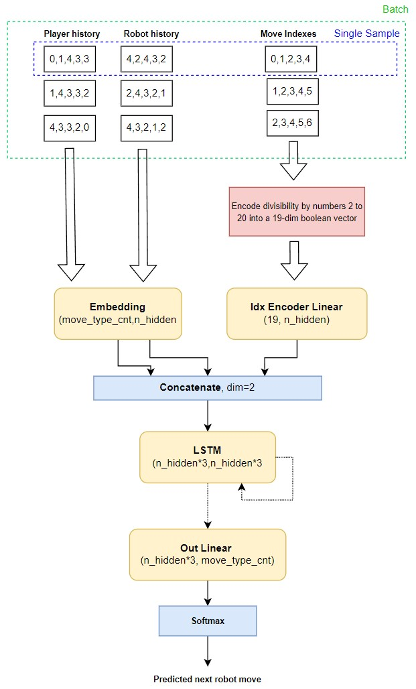

# FERIT 2022 RPSLS Competition - Winning Solution 🏆
This repository presents my solution to **FERIT's 2022 Rock, Paper, Scissors, Lizard, Spock competition** which achieved **1st place with a score of 1942/2000.** My approach was based on a recurrent neural network (LSTM) trained to predict the opponents next move by utilizing both player's move histories as well as move indexes to counter any index based strategy.

<p align="center">
  
</p>

<p align="center">
  
</p>


## Table of Contents
* [About](#about)
* [Setup](#setup)
* [Usage](#usage)
  * [Configuration](#configuration)
  * [Submission](#submission)
  * [Benchmark](#benchmark)
* [Strategy](#strategy)
* [Architecture](#architecture)
# About


**FERIT's 2022 RPSLS competition required the creation of a player algorithm to play against an unknown robot algorithm in the game of RPSLS. A submission is graded by the number of wins in a simulation of 2000 games in a row.**

```
In each of the 2000 games, the competitor and the robot decide on each of the numbers from 1 to 5, where:
1-scissors, 2-stone, 3-paper, 4-lizard, 5-spock.

Scissors are stronger than paper, paper is stronger than stone, stone is stronger than scissors. Scissors, stone and paper are stronger than lizards. Spock is stronger than everyone except the lizard he is weaker than.

In a loop from 1 to 2000, player A creates his move, ie chooses 1, 2, 3, 4 or 5, robot B his.
The winner in each of the 2000 games (if not tied, ie if the player and the robot did not choose the same number) gets a point. 
The overall winner of the prize game is the competitor who achieved the highest number of points (win) against the robot after 2000 games. 
When creating moves, the robot and the player in the calculation, ie creating their move, can use data on all previous moves of the opponent, and may use random selection functions and any mathematical functions.
```

# Setup

Using Miniconda/Anaconda:
1. `cd path_to_repo`
2. `conda env create`
3. `conda activate RPSLS`

# Usage

## Configuration
**The ML model used, it's training schedule and the overall strategy can be customized** with the parameters available in ```src/player/config.py```. The available parameters are described below:

- **EPOCH_CNT** - Maximum number of training epochs 
- **HIDDEN_LAYER_SIZE** - Size of the hidden layer inside the model
- **RANDOM_MOVE_CNT_GUARANTEE** - How many moves to initally play at random to gain data for training the model
- **BS** - Batch size
- **WIN_SIZE** - Window size, governs how much does the model look into the past while predicting the future
- **WIN_STEP_SIZE** - Window step size
- **TO_SHUFFLE** - Whether to shuffle the dataset
- **APPLY_MODEL_THRESHOLD** - Confidence threshold over which to act upon the model prediction rather than resorting to a random move
- **EARLY_STOPPING_PATIENCE** - Early stopping epoch patience
- **LR** - Learning rate
- **TRAIN_AT_STEPS** - Step indexes at which to force model retraining
- **TRAIN_DS_PROPORTION** - Proportion of train data relative to the whole dataset
- **WEIGHT_DECAY** - Weight decay regularization intensity
- **LOGGING_LEVEL** - Logging detail
- **STOP_TRAIN_AT_LOSS** - Stop training loss threshold to avoid time consuming training 


**For the winning submission the following configuration was used:**
```
EPOCH_CNT=1000
HIDDEN_LAYER_SIZE=32
RANDOM_MOVE_CNT_GUARANTEE=50
BS=64
WIN_SIZE=16
WIN_STEP_SIZE=1
TO_SHUFFLE=False
APPLY_MODEL_THRESHOLD=0.8
EARLY_STOPPING_PATIENCE=3
USE_LR_FINDER=False
LR=0.001
TRAIN_AT_STEPS=[50,100,150,200,300,500,800,1000]
TRAIN_DS_PROPORTION=0.8
WEIGHT_DECAY=0
LOGGING_LEVEL=2
STOP_TRAIN_AT_LOSS=1e-4
```

## Submission
**Official submission was evaluated by writing the offical robot code inside ```src/official_robot/make_move.py``` file and running the submission.**

To run the submission follow these steps:
1. Paste your robot code inside ```src/official_robot/make_move.py``` as below:
``` python
def get_robot_move(A,B, i):
    '''
    Generates the robot move
    '''
    # WRITE CODE BELOW:
    # -----START-----
```
2. Run ```python src/submission.py```. Player win count, draw count and robot win count will be printed in the console at the end. Every move will be saved to all_moves.txt at the end with an additional column describing who won.

## Benchmark
**In order to test the algorithm against multiple custom opponent algorithm you can use the benchmark script**

To run the benchmark process follow these steps:
1. Edit robot codes inside ```src/custom_robot/make_move.py```. This includes editing/creating a ```make_robot_move``` function and adding it to the robot dictionary at the bottom of the mentioned file
2. Run ```python src/benchmark.py```. Benchmark summary will be saved to benchmark_summary.txt file

# Strategy 
Brief overview of the strategy used:
- First, my algorithm plays a predetermined number of random moves (probability distribution over moves) in order to accumulate data for training a model
- Training data accumulated includes both player's histories and move indexes.
  - In order to reason about indexes the indexes were encoded as boolean vectors describing their divisiblity by numbers 2 to 20
- Once enough data is gathered an RNN model is trained, strategy here included:
  - Improving the backprop signal by predicting at every step rather than only the last
  - Using early stopping 
- A trained model is used to predict the robot's next move if its confidence is high. Otherwise a random move is played.
- Since the trained model can be overconfident I mandate retraining after a certain number of games played.
- Some hyperparameters were hardcoded (e.g. learning rate) at submission. Proper scale and value of these was determined by a hyperparameter search when playing against custom opponents.

# Architecture
My approach was based on a **recurrent neural network (LSTM) trained to predict the opponents next move by utilizing both player's move histories as well as move indexes to counter any index based strategy.** **Fine tunning regarding the training schedule and model hyperparameters has proven very valuable too.**


<a>
  <p align="center">
    
  </p>
</a>

